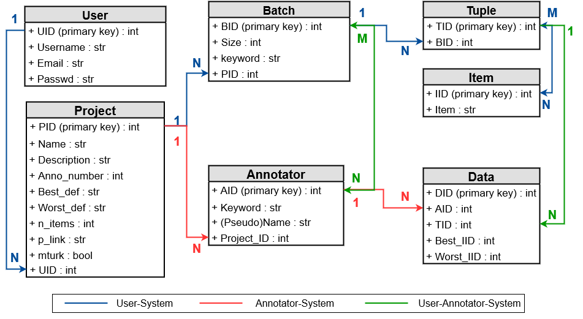

# Web Interface for Best-Worst-Scaling
 (Software Project WS 2019/2020)

## Author(s)
Dang Hoang Dung Nguyen nguyen@cl.uni-heidelberg.de

Maryna Charniuk charniuk@cl.uni-heidelberg.de

Sanaz Safdel safdel@cl.uni-heidelberg.de

## Overview

This project aims at creating a user-friendly website to annotate data 
using **Best-Worst-Scaling** ([Kiritchenko and Mohammad 2016](https://saifmohammad.com/WebPages/BestWorst.html)).

## Requirements

* [Python3.6](https://www.python.org/downloads/release/python-369/) only
* [Flask](https://flask.palletsprojects.com/)
* [Flask-Bootstrap](https://pythonhosted.org/Flask-Bootstrap/)
* [Flask-Login](https://flask-login.readthedocs.io/en/latest/)
* [Flask-WTF](https://flask-wtf.readthedocs.io/en/stable/)
* [Flask-SQLAlchemy](https://flask-sqlalchemy.palletsprojects.com/en/2.x/)
* [Boto3](https://boto3.amazonaws.com/v1/documentation/api/latest/reference/services/mturk.html)
* [Pytest](https://docs.pytest.org/en/latest/)
* [Sphinx](https://www.sphinx-doc.org/en/master/)

## Installation
* Create a virtual environment using [venv](https://docs.python.org/3/library/venv.html)
 or [virtualenv](https://virtualenv.pypa.io/en/latest/) to manage dependencies for this repository. (*recommended*)
* Clone the repository:
```sh
$ git clone https://gitlab.cl.uni-heidelberg.de/nguyen/swp.git
$ cd swp/
```

* After activating the virtual environment, run:
```sh
$ pip install -r requirements.txt
```
to install requirements for this project.

## How to

### 1. Web Application
In ```swp/``` run:
```sh
$ python main.py
```
The system works locally. Open this [URL](http://127.0.0.1:5000/ "Local development system") in any browser to access to the web application.

#### § Structure
    
In the following scheme is the structure of this directory for the web application :
```bash   
swp/
├── ...
├── __init__.py
├── config.py - Configurations
├── doc - Documentation
│   └── ...
├── examples - Example files for tests and running application in development environment
│   ├── empty_example.txt
│   ├── example_fewer_5.txt
│   ├── first_10_characters_examples
│   ├── first_10_characters_examples.txt
│   └── movie_reviews_examples.txt
├── main.py - Run application in development environment
├── project - Web Application
│   ├── __init__.py - Application Initialization
│   ├── annotator - Annotator Subsystem
│   │   ├── __init__.py
│   │   ├── account.py - Account Management
│   │   ├── annotation.py - Annotation Management
│   │   ├── forms.py - Forms
│   │   ├── helpers.py - Helper Functions
│   │   └── views.py - Views Management
│   ├── generator.py - Generators
│   ├── models.py - Database Models
│   ├── templates - Application Templates
│   │   ├── annotator - Templates in Annotator Subsystem
│   │   │   ├── batch.html
│   │   │   ├── index.html
│   │   │   └── project.html
│   │   ├── questions.xml - Keyword Template on Mechanical Turk
│   │   ├── start.html - Homepage
│   │   └── user - Templates in User Subsystem
│   │       ├── index.html
│   │       ├── login.html
│   │       ├── profile.html
│   │       ├── project.html
│   │       ├── signup.html
│   │       └── upload-project.html
│   ├── user - User Subsystem
│   │   ├── __init__.py
│   │   ├── account.py - Account Management
│   │   ├── forms.py - Forms
│   │   ├── helpers.py - Helper Functions
│   │   ├── inputs.py - Inputs Management
│   │   ├── outputs.py - Outputs Management
│   │   └── views.py - Views Management
│   └── validators.py - Form Validators
├── requirements.txt
└── tests
   └── ...
```

#### § Short User Manual
* In order to upload a project, you need an account first. Then, follow the instructions on the website.
* For the project, upload only non-empty ``.txt``-files. 
* There are 2 options how the annotation works:
	* Option 1: Local annotator system - You should find the annotators yourself. 
	* Option 2: ***Mechanical Turk*** - The project will be created on Amazon 
Crowdsourcing Platform - [Mechanical Turk](https://www.mturk.com/) as HITs. 
People that are interested in the HITS will accept and do the annotations. 
You don't need to find any annotator.
* At any time (when at least one annotator has submitted any batch), 2 files can be downloaded:
	* *scores.txt* : calculated scores of the items
	* *report.txt* : report with raw annotated datas 
    
### 2. Testing
To run test:
```sh
$ pytest
```

#### $ Structure
```sh
swp/
├── ...
├── ...
│	....
└── tests
    ├── __init__.py
    ├── conftest.py - Configurations
    ├── functional - Functional Tests
    │   ├── __init__.py
    │   ├── test_annotators.py - Annotator Account Tests
    │   ├── test_batches.py - Annotation Tests
    │   ├── test_projects.py - New Project Tests
    │   ├── test_users.py - User Account Tests
    │   └── test_wrong_cases_input_required.py - Extra Tests
    └── unit - Unit Tests
        ├── __init__.py
        ├── test_generator.py - Generator Tests
        └── test_models.py - Database Model Tests
```

#### § Tests
##### 1. Unit Tests
* Test creating and saving data in any table, test relationships between tables (see image below)



* Test adding uploaded items, creating tuples, creating batches
	+ Every uploaded item must be included.
    + Every item must be divided in at least one tuple.
   	+ Items must appear relatively in the same number of tuples: 2 conditions
    	1. Most of the items have the frequency in range (`average frequency - 2`, 
        `average frequency + 3` ). This happens because creating tuples from 
        source code is basically based on randomization and shuffling.
        + `Max frequency` and `min frequency` are in range `± 5` of `average frequency`.
    + Batches must be relatively equally divided: 2 cases
        + *Case 1* : for all batches:  `normal batch size` ≤ `batch size` ≤ `normal batch size + (minimum batch size - 1)`.

         **E.g.**: `normal batch size` = 20, `minimum batch size` = 5 => 20 ≤ `average batch size` ≤ 24. 
		+ *Case 2* : Accept only one batch that:  `minimum batch size` ≤ `batch size` < `normal batch size` and the rest has the size of `normal batch size`. 

        **E.g.**: `normal batch size` = 20, `minimum batch size` = 5, `46` tuples => 2 batches with size of `20`, 1 batch with size of `6`
        
        
##### 2. Functional Tests
* Test validations in user account
    * Test validations in user registration
        * Username, email are never used before.
        * Username has no special character, meets the length requirement.
        * Email must have email format, meets the length requirement.
        * Password must meet the length requirement.
    * Test validations in user login
        * Not signed up username returns error.
        * Invalid password for valid username is not accepted. 
* Test validations in uploading a project
    * There must exist at least one non-empty `txt`-file.
    * At least 5 uploaded items for the project.
    * Project description must be long enough (at least 20 characters long).
    * **Best** and **Worst** definitions are not the same.
* Test validation in annotator login
	* If keyword is already used, the pseudoname must correspond to given pseudoname before. (2 annotators do not have the same keyword)
* Test validations in annotating a batch
	* Every field is required.
    * In a tuple, an item is not allowed to be chosen as both **Best** and **Worst**.

> **Note**: No validation of required inputs for form attributes defined as 
`MultipleFileField`, `StringField`, `PasswordField` or `TextAreaField` from module
[wtforms.fields](https://wtforms.readthedocs.io/en/stable/fields.html) in this project.
>
> **Reason**: Validator `InputRequired` used from module 
[wtforms.validators](https://wtforms.readthedocs.io/en/stable/validators.html#wtforms.validators.InputRequired) 
can validate this requirement directly on web server but during testing in backend, 
those fields are misinterpreted (due to [source codes](https://github.com/wtforms/wtforms/blob/master/src/wtforms/fields/core.py)). 
More information see cases in `tests/functional/test_wrong_cases_input_required.py` 

### 3. Documentation
* Documentation for the whole script is in ``Web_Inteface.pdf``.

* To read the documentation in HTML:
```sh
$ cd ./doc/build/html/
$ open index.html
```


## Additional Resource
* Bryan K. Orme.  *Maxdiff analysis : Simple counting , individual-level logit, and
hb*.  2009. [URL](https://www.sawtoothsoftware.com/download/techpap/indivmaxdiff.pdf)
* Saif Mohammad and Peter D. Turney. *Crowdsourcing a word-emotion association 
lexicon*. CoRR, abs/1308.6297, 2013. [URL](http://arxiv.org/abs/1308.6297).
* Svetlana Kiritchenko and Saif M. Mohammad.  *Best-worst scaling more reliable than 
rating scales: A case study on sentiment intensity annotation*. CoRR,
abs/1712.01765, 2017. [URL](http://arxiv.org/abs/1712.01765)
